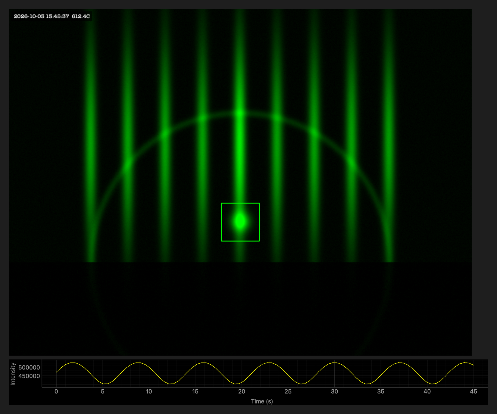
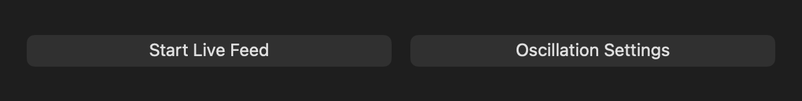
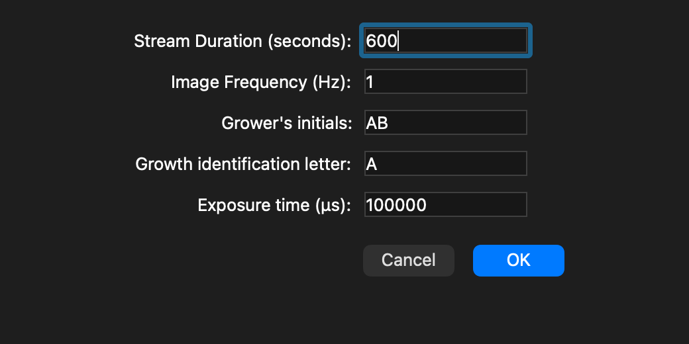

<!-- Last edited: 2026-10-03 13:50 CDT -->
<a id="readme-top"></a>

[![Contributors][contributors-shield]][contributors-url]
[![Forks][forks-shield]][forks-url]
[![Stargazers][stars-shield]][stars-url]
[![Issues][issues-shield]][issues-url]
[![MIT License][license-shield]][license-url]

<br />
<div align="center">
  <a href="https://github.com/JacquesAttinger/RHEED-Viewer">
    
  </a>

  <h3 align="center">RHEED Viewer</h3>

  <p align="center">
    Live viewing, recording, and temperature logging for RHEED during thin-film growth.
    <br />
    <a href="#getting-started"><strong>Get started »</strong></a>
    <br />
    <br />
    <a href="https://github.com/JacquesAttinger/RHEED-Viewer/issues/new">Report a bug or request a feature</a>
  </p>
</div>

<details>
  <summary>Table of Contents</summary>
  <ol>
    <li>
      <a href="#about-the-project">About The Project</a>
      <ul>
        <li><a href="#built-with">Built With</a></li>
      </ul>
    </li>
    <li><a href="#usage">Usage</a></li>
    <li>
      <a href="#getting-started">Getting Started</a>
      <ul>
        <li><a href="#prerequisites">Prerequisites</a></li>
        <li><a href="#installation">Installation</a></li>
      </ul>
    </li>
    <li><a href="#contributing">Contributing</a></li>
    <li><a href="#license">License</a></li>
    <li><a href="#contact">Contact</a></li>
  </ol>
</details>

## About The Project

RHEED Viewer is a desktop app for acquiring, displaying, and saving [Reflection High-Energy Electron Diffraction (RHEED)](https://en.wikipedia.org/wiki/Reflection_high-energy_electron_diffraction) data in real time.
RHEED is how growers watch a thin film form, layer by layer, inside a molecular beam epitaxy (MBE) chamber.



The screenshots in this README come from the real windows running with a simulated camera and pyrometer.
The RHEED pattern and the oscillation trace are synthetic and only show the layout.
In the live feed, the frame shows a timestamp and the pyrometer temperature, the green box is the ROI, and the yellow trace is the ROI intensity over time.

Proprietary RHEED software has more advanced features.
RHEED Viewer gives you something different: full control over how data is saved, so it plugs into your own processing pipeline.

Features:

- **Live RHEED feed.** View the diffraction pattern in real time with adjustable exposure and frame rate.
- **Intensity oscillations.** Draw a rectangular region of interest (ROI) on the live feed and plot its intensity over time.
- **Image acquisition.**
  - *Single capture* saves one frame.
  - *Streaming* records a sequence of frames at a frequency and duration you choose, which is useful for saving growth trajectories.
- **Temperature metadata.** Readings from a connected BASF EXACTUS pyrometer and timestamps go into the saved file names, so you can line up temperature with each RHEED image.

Two entry points exist today, one per MBE system in the lab where this was built: `CalcogenideMBE_Rheed_GUI.py` and `OxideMBE_RHEED_GUI.py`.

<p align="right">(<a href="#readme-top">back to top</a>)</p>

### Built With

* [![Python][Python-badge]][Python-url]
* [![Qt][Qt-badge]][PySide-url]
* [![NumPy][NumPy-badge]][NumPy-url]
* [![pandas][pandas-badge]][pandas-url]
* [![Plotly][Plotly-badge]][Plotly-url]
* [![Matplotlib][Matplotlib-badge]][Matplotlib-url]
* [PyQtGraph](https://www.pyqtgraph.org/) for live plots
* [VmbPy](https://github.com/alliedvision/VmbPy) for Allied Vision cameras
* [pymodbus](https://github.com/pymodbus-dev/pymodbus) and [MinimalModbus](https://github.com/pyhys/minimalmodbus) for pyrometer communication
* [pywinauto](https://pywinauto.readthedocs.io/) for controlling the pyrometer's TemperaSure software

<p align="right">(<a href="#readme-top">back to top</a>)</p>

## Usage

Start the GUI for your MBE system:

```sh
# Calcogenide MBE
python Code/CalcogenideMBE_Rheed_GUI.py

# Oxide MBE
python Code/OxideMBE_RHEED_GUI.py
```

Typical workflow:

1. **Start Live Feed.** Click to begin viewing the camera stream.
2. **Oscillation Settings.** Define an ROI to track intensity changes.
3. **Acquire or stream.**
   - Click **Acquire RHEED Image** for a snapshot.
   - Click **Start RHEED Stream** to record a sequence. A dialog asks for duration, frequency, exposure time, and grower initials.

The control window at start-up, before you start the live feed:



The stream settings dialog:



<p align="right">(<a href="#readme-top">back to top</a>)</p>

## Getting Started

To run RHEED Viewer on your own machine, follow these steps.

### Prerequisites

* An Allied Vision camera and the [Vimba X](https://www.alliedvision.com/en/products/software/vimba-x-sdk/) drivers (used through `vmbpy`)
* A BASF EXACTUS pyrometer, if you want temperature metadata
* [Conda](https://docs.conda.io/en/latest/) (Anaconda or Miniconda)
* Windows. The app was built and run on Windows lab PCs, and the pyrometer control uses `pywinauto`.

### Installation

1. Clone the repo
   ```sh
   git clone https://github.com/JacquesAttinger/RHEED-Viewer.git
   cd RHEED-Viewer
   ```
2. Create and activate the Conda environment
   ```sh
   conda env create -f environment.yml
   conda activate py311
   ```
3. Edit the save folders and pyrometer path near the top of the entry-point script for your machine.
   For example, set `single_images_folder` and `stream_images_folder` in `Code/OxideMBE_RHEED_GUI.py`.

<p align="right">(<a href="#readme-top">back to top</a>)</p>

## Contributing

Contributions are what make the open source community a great place to learn and build.
Any contribution you make is **greatly appreciated**.

If you have an idea, open an [issue](https://github.com/JacquesAttinger/RHEED-Viewer/issues) or fork the repo and open a pull request.

1. Fork the project
2. Create your feature branch (`git checkout -b feature/AmazingFeature`)
3. Commit your changes (`git commit -m 'Add some AmazingFeature'`)
4. Push to the branch (`git push origin feature/AmazingFeature`)
5. Open a pull request

### Top contributors

<a href="https://github.com/JacquesAttinger/RHEED-Viewer/graphs/contributors">
  
</a>

<p align="right">(<a href="#readme-top">back to top</a>)</p>

## License

Distributed under the MIT License.
See [`LICENSE`](LICENSE) for more information.

<p align="right">(<a href="#readme-top">back to top</a>)</p>

## Contact

Jacques Attinger - [@JacquesAttinger](https://github.com/JacquesAttinger)

Project link: [https://github.com/JacquesAttinger/RHEED-Viewer](https://github.com/JacquesAttinger/RHEED-Viewer)

<p align="right">(<a href="#readme-top">back to top</a>)</p>

[contributors-shield]: https://img.shields.io/github/contributors/JacquesAttinger/RHEED-Viewer.svg?style=for-the-badge
[contributors-url]: https://github.com/JacquesAttinger/RHEED-Viewer/graphs/contributors
[forks-shield]: https://img.shields.io/github/forks/JacquesAttinger/RHEED-Viewer.svg?style=for-the-badge
[forks-url]: https://github.com/JacquesAttinger/RHEED-Viewer/network/members
[stars-shield]: https://img.shields.io/github/stars/JacquesAttinger/RHEED-Viewer.svg?style=for-the-badge
[stars-url]: https://github.com/JacquesAttinger/RHEED-Viewer/stargazers
[issues-shield]: https://img.shields.io/github/issues/JacquesAttinger/RHEED-Viewer.svg?style=for-the-badge
[issues-url]: https://github.com/JacquesAttinger/RHEED-Viewer/issues
[license-shield]: https://img.shields.io/github/license/JacquesAttinger/RHEED-Viewer.svg?style=for-the-badge
[license-url]: https://github.com/JacquesAttinger/RHEED-Viewer/blob/main/LICENSE
[Python-badge]: https://img.shields.io/badge/Python-3776AB?style=for-the-badge&logo=python&logoColor=white
[Python-url]: https://www.python.org/
[Qt-badge]: https://img.shields.io/badge/PySide6-41CD52?style=for-the-badge&logo=qt&logoColor=white
[PySide-url]: https://doc.qt.io/qtforpython-6/
[NumPy-badge]: https://img.shields.io/badge/NumPy-013243?style=for-the-badge&logo=numpy&logoColor=white
[NumPy-url]: https://numpy.org/
[pandas-badge]: https://img.shields.io/badge/pandas-150458?style=for-the-badge&logo=pandas&logoColor=white
[pandas-url]: https://pandas.pydata.org/
[Plotly-badge]: https://img.shields.io/badge/Plotly-3F4F75?style=for-the-badge&logo=plotly&logoColor=white
[Plotly-url]: https://plotly.com/python/
[Matplotlib-badge]: https://img.shields.io/badge/Matplotlib-11557C?style=for-the-badge
[Matplotlib-url]: https://matplotlib.org/
